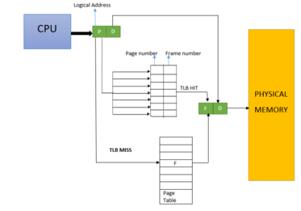

# TLB(Translation Lookaside Buffer) 页表缓存

 is a memory cache that is used to reduce the time taken to access a user memory location.[1][2] It is a part of the chip’s memory-management unit (MMU). The TLB stores the recent translations of virtual memory to physical memory and can be called an address-translation cache. A TLB may reside between the CPU and the CPU cache, between CPU cache and the main memory or between the different levels of the multi-level cache. The majority of desktop, laptop, and server processors include one or more TLBs in the memory-management hardware, and it is nearly always present in any processor that utilizes paged or segmented virtual memory.

The TLB is sometimes implemented as content-addressable memory (CAM). The CAM search key is the virtual address, and the search result is a physical address. If the requested address is present in the TLB, the CAM search yields a match quickly and the retrieved physical address can be used to access memory. This is called a TLB hit. If the requested address is not in the TLB, it is a miss, and the translation proceeds by looking up the page table in a process called a page walk. The page walk is time-consuming when compared to the processor speed, as it involves reading the contents of multiple memory locations and using them to compute the physical address. After the physical address is determined by the page walk, the virtual address to physical address mapping is entered into the TLB. The PowerPC 604, for example, has a two-way set-associative TLB for data loads and stores.[3] Some processors have different instruction and data address TLBs.

简单地说，TLB就是页表的Cache，其中存储了当前最可能被访问到的页表项，其内容是部分页表项的一个副本。

TLB中的项由两部分组成：标识和数据。标识中存放的是虚地址的一部分，而数据部分中存放物理页号、存储保护信息以及其他一些辅助信息.

虚地址与TLB中项的映射方式有三种：全关联方式、直接映射方式、分组关联方式。

TLB的内部内容：

TLB might have 32, 64, or 128 entries and be what is called fully associative.
Basically, this just means that any given translation can be anywhere
in the TLB, and that the hardware will search the entire TLB in parallel to
find the desired translation. A TLB entry might look like this:

 | VPN | PFN | other bits

Note that both the VPN and PFN are present in each entry, as a translation
could end up in any of these locations (in hardware terms, the TLB
is known as a fully-associative cache)

TLB的基本算法：

	
		1 VPN = (VirtualAddress & VPN_MASK) >> SHIFT
		2 (Success, TlbEntry) = TLB_Lookup(VPN)
		3 if (Success == True) // TLB Hit
		4 	if (CanAccess(TlbEntry.ProtectBits) == True)
		5 		Offset = VirtualAddress & OFFSET_MASK
		6 		PhysAddr = (TlbEntry.PFN << SHIFT) | Offset
		7 		Register = AccessMemory(PhysAddr)
		8 	else
		9 		RaiseException(PROTECTION_FAULT)
		10 else // TLB Miss
		11 	PTEAddr = PTBR + (VPN * sizeof(PTE))
		12 	PTE = AccessMemory(PTEAddr)
		13 if (PTE.Valid == False)
		14 	RaiseException(SEGMENTATION_FAULT)
		15 else if (CanAccess(PTE.ProtectBits) == False)
		16 	RaiseException(PROTECTION_FAULT)
		17 else
		18 	TLB_Insert(VPN, PTE.PFN, PTE.ProtectBits)
		19 RetryInstruction()
	

[相关网址](https://blog.csdn.net/chuanzhilong/article/details/53185559)

[详细书籍](http://pages.cs.wisc.edu/~remzi/OSTEP/vm-tlbs.pdf)