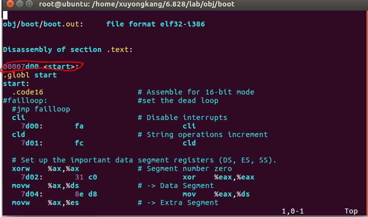
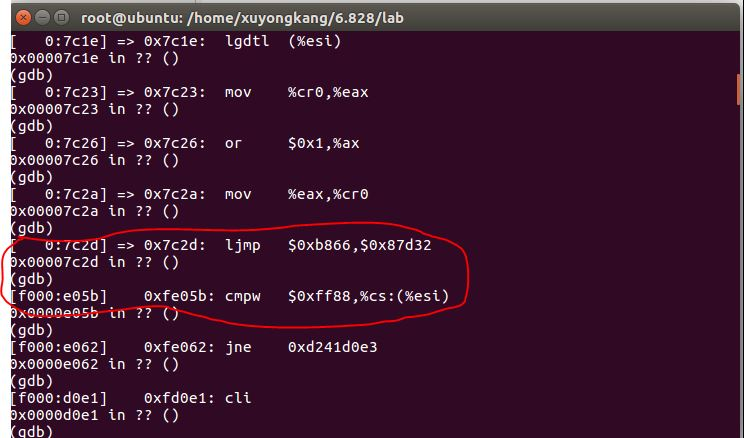

###这次要求我们对引导加载程序boot进行破坏来验证其之后的产生的情况

在实验中将-Ttext 0x7C00写成0x7D00这样可以预测mbr的512的字节仍然被读到0x7c00-0x7E00的位置

然后我们接着进行make qemu-gdb

然后make gdb进行调试

起初一切运行正常直到

jmp $0xb866,$0x87d32
这一部要经过段选择符配合GDTR中的地址来获取段描述符但是GDTR中存储的描述符表表头位置的地址与表头地址在实际内存中的地址相差0x100所以最终造成找到错误的表头地址因此在访问的时候访问到错误的段因此造成机器不停的重启BIOS。

