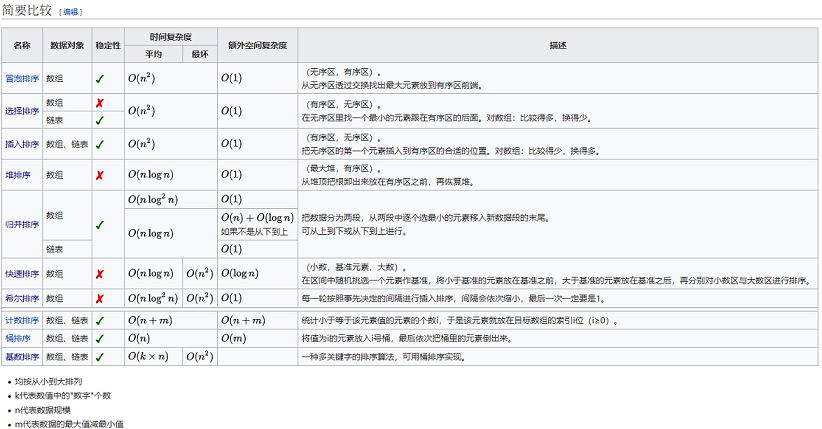

## 插入排序

### 插入排序

 

* 算法描述

    1. **从第一个元素开始，该元素可以认为已经被排序**
    2. **取出下一个元素，在已经排序的元素序列中从后向前扫描**
    3. 如果该元素（已排序）大于新元素，将该元素移到下一位置
    4. 重复步骤3，直到找到已排序的元素小于或者等于新元素的位置
    5. 将新元素插入到该位置后
    6. 重复步骤2~5
		

* 时间复杂度
	平均情况$O(n^2)$最好形况$O(n)$最坏情况$O(n^2)$

* 空间复杂度
	空间复杂度：O(1)

* 拓展
	如果比较操作的代价比交换操作大的话，可以采用二分查找法来减少比较操作的数目。该算法可以认为是插入排序的一个变种，称为二分查找插入排序。
	
* 代码

template<typename T>//插入排序
void insert_sort(vector<T>& arr)
{
	for(int i = 1;i < arr.size()-1;i++)
	{
		int temp = arr[i];
		for(int j = i - 1;j >= 0;j--)
		{
			if(arr[j] > temp)
			{
				arr[j + 1] = arr[j];
				arr[j] = temp;
			}
			else break;
		}
	}
}


### 希尔排序

* 算法描述

	希尔排序通过将比较的全部元素分为几个区域来提升插入排序的性能。这样可以让一个元素可以一次性的朝最终位置前进一大步。然后算法再取越来越小的步长进行排序，算法的最后一步就是普通的插入排序，但是到了这一步，需要排序的数据几乎是已经排好的了。

	* 步长序列 
 		已知的最好步长序列是由Sedgewick提出的(1, 5, 19, 41, 109,...)，该序列的项来自 $9*4^i-9*2^i+1$和$2^{(i+2)}*(2^{(i+2)}-3)+1$这两个算式。

* 时间复杂度：

	平均情况：$O(n^{1.3})$
	最好情况：$O(n)$
	最坏情况：$O(n^2)$
	
* 空间复杂度：
	
	空间复杂度：O(1)

* 代码：

void shell_sort(vector<int>& vec, int first, int last)
{
	for(int i = first; i<last; i++)
	{
		for(int N = (last-first)+1; N>=1; N/=2)
		for(int j = first+1; j<=last; j+=N)
		{
			if(vec[i]>vec[j])
				swap(vec[i], vec[j]);
		}
	}
}


## 选择排序

### 选择排序（类似于插入排序）

 

* 算法描述

    1. **首先在未排序序列中找到最小（大）元素，存放到排序序列的起始位置**
    2. 然后，再从剩余未排序元素中继续寻找最小（大）元素，然后放到已排序序列的末尾。
    3. 以此类推，直到所有元素均排序完毕。
	
* 时间复杂度：
 	平均情况$O(n^2)$最好形况$O(n^2)$最坏情况$O(n^2)$

* 空间复杂度：
 	O(1)
* 代码：

template<typename T> 
void selection_sort(std::vector<T>& arr) {
	for (int i = 0; i < arr.size() - 1; i++) {
	    int min = i;
		for (int j = i + 1; j < arr.size(); j++)
			if (arr[j] < arr[min])
				min = j;
		std::swap(arr[i], arr[min]);
	}
}


### 堆排序（注意查看代码，不会）

* 算法描述：若以升序排序说明

    1. 把数组转换成最大堆积(Max-Heap Heap)，这是一种满足最大堆积性质(Max-Heap Property)的二叉树：对于除了根之外的每个节点i, A[parent(i)] ≥ A[i]。
    2. 重复从最大堆积取出数值最大的结点(把根结点和最后一个结点交换，把交换后的最后一个结点移出堆)，并让残余的堆积维持最大堆积性质。

	* 相关操作：
		* 堆节点的访问：
			通常堆是通过一维数组来实现的。在数组起始位置为0的情形中：
            * 父节点i的左子节点在位置 ${(2i+1)}$;
            * 父节点i的右子节点在位置 ${(2i+2)}$;
            * 子节点i的父节点在位置 $floor((i-1)/2)$;

		* 堆的操作：
            在堆的数据结构中，堆中的最大值总是位于根节点(在优先队列中使用堆的话堆中的最小值位于根节点)。堆中定义以下几种操作：
            * 最大堆调整（Max_Heapify）：将堆的末端子节点作调整，使得子节点永远小于父节点
            * 创建最大堆（Build_Max_Heap）：将堆所有数据重新排序
            * 堆排序（HeapSort）：移除位在第一个数据的根节点，并做最大堆调整的递归运算

* 时间复杂度：
 	平均情况$O(nlog2n)$
	最好形况$O(nlog2n)$
	最坏情况$O(nlog2n)$

* 空间复杂度：
 	$O(1)$

* 稳定性：
 	不稳定

* 代码：

#include <iostream>
#include <algorithm>
using namespace std;

void max_heapify(int arr[], int start, int end) {
	//建立父節點指標和子節點指標
	int dad = start;
	int son = dad * 2 + 1;
	while (son <= end) { 
		//若子節點指標在範圍內才做比較
		if (son + 1 <= end && arr[son] < arr[son + 1]) 
		//先比較兩個子節點大小，選擇最大的
			son++;
		if (arr[dad] > arr[son]) 
		//如果父節點大於子節點代表調整完畢，直接跳出函數
			return;
		else { //否則交換父子內容再繼續子節點和孫節點比較
			swap(arr[dad], arr[son]);
			dad = son;
			son = dad * 2 + 1;
		}
	}
}

void heap_sort(int arr[], int len) {
	//初始化，i從最後一個父節點開始調整
	for (int i = len / 2 - 1; i >= 0; i--)
		max_heapify(arr, i, len - 1);
	//先將第一個元素和已经排好的元素前一位做交換，
	//再從新調整(刚调整的元素之前的元素)，直到排序完畢
	for (int i = len - 1; i > 0; i--) {
		swap(arr[0], arr[i]);
		max_heapify(arr, 0, i - 1);
	}
}

int main() {
	int arr[] = { 3, 5, 3, 0, 8, 6, 1, 5, 8, 6, 2, 4, 9, 4, 7, 0, 1, 8, 9, 7, 3, 1, 2, 5, 9, 7, 4, 0, 2, 6 };
	int len = (int) sizeof(arr) / sizeof(*arr);
	heap_sort(arr, len);
	for (int i = 0; i < len; i++)
		cout << arr[i] << ' ';
	cout << endl;
	return 0;
}


## 比较排序

### 冒泡排序

* 算法描述：
	1. 比较相邻的元素。如果第一个比第二个大，就交换他们两个。
	2. 对每一对相邻元素作同样的工作，从开始第一对到结尾的最后一对。这步做完后，最后的元素会是最大的数。
	3. 针对所有的元素重复以上的步骤，除了最后一个。
	4. 持续每次对越来越少的元素重复上面的步骤，直到没有任何一对数字需要比较。

* 时间复杂度：
	
	平均复杂度$O(n^2)$最好情况$O(n)$最坏情况$O(n^2)$
	
* 空间复杂度：
	$O(1)$

* 稳定性：
	稳定

* 代码：

void bubble_sort(int arr[], int len) {
int i, j, temp;
for (i = 0; i < len - 1; i++)
	for (j = 0; j < len - 1 - i; j++)
		if (arr[j] > arr[j + 1]) {
			temp = arr[j];
			arr[j] = arr[j + 1];
			arr[j + 1] = temp;
		}
}


### **快速排序**

  

**快速排序**：（英语：Quicksort），又称**划分交换排序**（partition-exchange sort），简称**快排**，一种排序算法，最早由[东尼·霍尔](https://zh.wikipedia.org/wiki/%E6%9D%B1%E5%B0%BC%C2%B7%E9%9C%8D%E7%88%BE)提出。在平均状况下，排序**$n$**个项目要**$O(nlog n)$**([大O符号](https://zh.wikipedia.org/wiki/%E5%A4%A7O%E7%AC%A6%E5%8F%B7)）次比较。在最坏状况下则需要**$O(nlogn)$**次比较，但这种状况并不常见。事实上，快速排序**$O(nlogn)$****通常明显比其他算法更快，因为它的内部循环（inner loop）可以在大部分的架构上很有效率地达成**。

* **算法描述**：

    1. **挑出基准值：**从数列中挑出一个元素，称为"基准"（pivot），
    2. **分割：**重新排序数列，**所有比基准值小的元素摆放在基准前面**，**所有比基准值大的元素摆在基准后面**（相同的数可以到任何一边）。在这个分区结束之后，该基准就处于数列的中间位置。这个称为分区（partition）操作。
    3. **递归排序子序列：**递归地（recursively）把小于基准值元素的子数列和大于基准值元素的子数列排序。
		

* 时间复杂度：
	平均情况$O(nlog2n)$
	最好形况$O(nlog2n)$
	最坏情况$O(n^2)$

* 空间复杂度：
	$O(nlog2n)$

* 稳定性：
	不稳定
* 代码：

function quicksort(q)
{
	var list less, pivotList, greater
	if length(q) ≤ 1 
		return q
	else 
	{
		select a pivot value pivot from q
		for each x in q except the pivot element
		{
			if x < pivot then add x to less
			if x ≥ pivot then add x to greater
		}
		add pivot to pivotList
		return concatenate(quicksort(less), pivotList, quicksort(greater))
	}
}



//迭代法
struct Range {
	int start, end;
	Range(int s = 0, int e = 0) {
		start = s, end = e;
	}
};
template <typename T> 
void quick_sort(T arr[], const int len) {
	if (len <= 0)
		return; 
	Range r[len];
	int p = 0;
	r[p++] = Range(0, len - 1);
	while (p) {
		Range range = r[--p];
		if (range.start >= range.end)
			continue;
		T mid = arr[range.end];
		int left = range.start, right = range.end - 1;
		while (left < right) {
			while (arr[left] < mid && left < right) left++;
			while (arr[right] >= mid && left < right) right--;
			std::swap(arr[left], arr[right]);
		}
		if (arr[left] >= arr[range.end])
			std::swap(arr[left], arr[range.end]);
		else
			left++;
		r[p++] = Range(range.start, left - 1);
		r[p++] = Range(left + 1, range.end);
	}
}	



//递归法
int getprovit(vector<int>& vec, int first, int last)
{
	int mid = first+(last-first)/2;
	if(vec[first]>vec[last])
		swap(vec[first], vec[last]);
	if(vec[mid] > vec[last])
		swap(vec[mid], vec[last]);
	if(vec[mid] < vec[first])
		swap(vec[mid], vec[first]);
	return vec[mid];
}

void quicksort(vector<int>& vec, int first, int last){

	if(last-first+1 < 3)
	{
		if(last-first+1 == 1)
			return;
		else{
			if(vec[first] > vec[last])
				swap(vec[first], vec[last]);
		}
	}else{
		int provit = getprovit(vec, first, last);
		swap(vec[first+(last-first)/2], vec[last-1]);
		int i = first;
		int j = last-1;
		for(;;)
		{
			while(vec[++i] < provit){;}
			while(vec[--j] > provit){;}
			if(i<j){
				swap(vec[i], vec[j]);
			}else{
				break;
			}
		}
		swap(vec[i], vec[last-1]);
		quicksort(vec, first, i-1);
		quicksort(vec, i+1, last);
	}

}


### 归并排序

* 算法描述

	* **递归法（Top-down）**
		1. 申请空间，使其大小为两个已经排序序列之和，该空间用来存放合并后的序列
        2. 设定两个指针，最初位置分别为两个已经排序序列的起始位置
        3. 比较两个指针所指向的元素，选择相对小的元素放入到合并空间，并移动指针到下一位置
        4. 重复步骤3直到某一指针到达序列尾
        5. 将另一序列剩下的所有元素直接复制到合并序列尾

	* **迭代法（Bottom-up）:**
        原理如下（假设序列共有n个元素）：
        1. 将序列每相邻两个数字进行归并操作，形成ceil(n/2)个序列，排序后每个序列包含两/一个元素
        2. 若此时序列数不是1个则将上述序列再次归并，形成ceil(n/4)个序列，每个序列包含四/三个元素
        3. 重复步骤2，直到所有元素排序完毕，即序列数为1

* 时间复杂度：
	平均情况$O(nlogn)$
	最好形况$O(nlogn)$
	最坏情况$O(nlogn)$
	
* 空间复杂度：
	O（n）

* **代码：**
   
//迭代版：
template<typename T> 
void merge_sort(T arr[], int len) {
	T* a = arr;
	T* b = new T[len];
	for (int seg = 1; seg < len; seg += seg) {
		for (int start = 0; start < len; start += seg + seg) {
			int low = start, mid = min(start + seg, len), high = min(start + seg + seg, len);
			int k = low;
			int start1 = low, end1 = mid;
			int start2 = mid, end2 = high;
			while (start1 < end1 && start2 < end2)
				b[k++] = a[start1] < a[start2] ? a[start1++] : a[start2++];
			while (start1 < end1)
				b[k++] = a[start1++];
			while (start2 < end2)
				b[k++] = a[start2++];
		}
		T* temp = a;
		a = b;
		b = temp;
	}
	if (a != arr) {
		for (int i = 0; i < len; i++)
			b[i] = a[i];
		b = a;
	}
	delete[] b;
}



//递归版：
template<typename T>
void merge_sort_recursive(T arr[], T reg[], int start, int end) {
	if (start >= end)
		return;
	int len = end - start, mid = (len >> 1) + start;
	int start1 = start, end1 = mid;
	int start2 = mid + 1, end2 = end;
	merge_sort_recursive(arr, reg, start1, end1);
	merge_sort_recursive(arr, reg, start2, end2);
	int k = start;
	while (start1 <= end1 && start2 <= end2)
		reg[k++] = arr[start1] < arr[start2] ? arr[start1++] : arr[start2++];
	while (start1 <= end1)
		reg[k++] = arr[start1++];
	while (start2 <= end2)
		reg[k++] = arr[start2++];
	for (k = start; k <= end; k++)
		arr[k] = reg[k];
}
template<typename T> //整數或浮點數皆可使用,若要使用物件(class)時必須設定"小於"(<)的運算子功能
void merge_sort(T arr[], const int len) {
	T reg = new T[len];
	merge_sort_recursive(arr, reg, 0, len - 1);
	delete[] reg;
}


## 非比较排序-计数排序

[原文](https://www.cnblogs.com/onepixel/p/7674659.html)
### 桶排序
(使用空间多，不是基于比较的方法)
**桶排序的基本原理:**
桶排序是计数排序的升级版。它利用了函数的映射关系，高效与否的关键就在于这个映射函数的确定。桶排序 (Bucket sort)的工作的原理：**假设输入数据服从均匀分布，将数据分到有限数量的桶里，每个桶再分别排序**（有可能再使用别的排序算法或是以递归方式继续使用桶排序进行排）。

**算法描述：**

1. 设置一个定量的数组当作空桶；
2. 遍历输入数据，并且把数据一个一个放到对应的桶里去；
3. 对每个不是空的桶进行排序；
4. 从不是空的桶里把排好序的数据拼接起来。 

**算法分析：**
最好的情况下使用的是线性时间O(n),**桶排序的时间复杂度度，取决于各个桶之间的数据进行排序的时间复杂度**，因为其他部分的时间复杂度都是O(n)。缺点就是消耗的空间取决于数据的类型，而且无法在排序前进行预估，这样在计算机重新开辟空间的过程中就会消耗大量的额外时间。

### 基数排序

**基数排序的基本原理：**
基数排序是**按照低位进行排序，然后收集；再按照高位排序，然后收集；依次类推，知道最高位**。有时候有些属性是有优先级顺序的，先按低优先级排序，再按高优先级排序。最后的次序就是高优先级高的在前，高优先级相同的低优先级高的在前。

**算法描述：**

如下图：从低位开始，逐步向高位排列知道排完了所有的位数

**算法分析：**

基数排序的**时间复杂度是O(k*n)，其中n是排序元素的个数，k是数字位数**。注意这不是说这个时间复杂度一定优于O(nlogn),k的大小却决于数字位的选择（比如比特位数），和待排序数据所属数据类型的全集的大小；k决定了进行多少轮处理，而n是每轮处理的操作数目。
以排序n个不同的整数来举例，假定这些整数以**B**为底，这样每位数都有B个不同的数字，k=logBN,N是待排序数据类型全集的势。（？）虽然有B个不同的数字，需要B个不同的桶，但在每一轮处理中，判断每个待排序数据项只需要一次计算确定对应的数字的值，因此在每一轮处理的时候都需要平均n次操作来把整数放到合适的桶中去，所有就有：

k约等于logBN

所以，基数排序的平均时间T就是

T约等于logB(N)*n

其中前一项是一个与输入数据无关的常数，当然该项不一定小于Logn

如果考虑和**比较排序**进行对照，基数排序的形式复杂度虽然不一定更小，但由于不进行比较，因此其基本操作代价较小，而且在适当选择B之下，k一般不大于logn，**所以基数排序一般要快过基于比较的排序，比如快速排序**。

### 哈希表排序

## 另外特殊的还有

### 表排序
（这个是间接排序是为了防止多次移动待排数列造成时间花费过大）

## 快速排序、堆排序、归并排序的竞争

快速排序的**最直接竞争者是堆排序（Heapsort）**。堆排序通常比快速排序稍微慢，**但是最坏情况的运行时间总是O(nlogn)**。快速排序是经常比较快，除了introsort变化版本外，仍然有最坏情况性能的机会。如果事先知道堆排序将会是需要使用的，那么直接地使用堆排序比等待introsort再切换到它还要快。堆排序也拥有重要的特点，仅使用固定额外的空间（堆排序是原地排序），而即使是最佳的快速排序变化版本也需要$O(nlogn)$的空间。然而，堆排序需要有效率的随机存取才能变成可行。

**正规分析：**

1. 分析方法（1）
从一开始快速排序平均花费**$O(nlogn)$**时间的描述并不明显，但是不难观察到的是分割运算，数组的元素都会在每次循环中走访一次，使用**O(n)**的时间。在使用结合(concatenation)的版本中，这项运算也是**$O(n)$**。
**在最好的情况，每次我们运行一次分割，我们会把一个数列分为两个几乎相等的片段。这个意思就是每次递归调用处理一半大小的数列**。因此，在到达大小为1的数列前，我们只要做**$logn$**此嵌套调用。这个意思就是调用树的深度是**$O(logn)$**。但是在同一层次结构的两个程序调用中，不会处理到原来数列的相同部分；因此，程序调用的每一层次结构总共全部仅需要**$O(n)$**的时间（每个调用有某些共同的额外耗费，但是因为在每一层次结构仅仅只有**$O(n)$**个调用，这些被归纳在**$O(n)$**系数中）。结果是这个算法仅需要使用**$O(nlogn)$**时间。
2. 分析方法（2）
另一个方法为T(n)设立一个递归关系式，也就是需要排序大小为n的数列所需要的时间，。在最好的情况下，因为一个单独的快速排序是调用涉及了O(n)的工作，加上对n/2大小数列的两个递归调用，这个关系式可以是：T(n)=o(N)+2T(n/2)

**使用数学归纳法告诉我们T(n)=O(nlogn)<?>**

事实上，并不需要把数列如此精确地分割；即使如果每个基准值将元素分开为99%在一边1%在另一边，调用的深度仍然限制在100logn，所以全部运行时间依然是O(nlogn)。

然而，在最坏的情况下，两个子数列拥有各为1和n-1，且调用树变成了一个n个嵌套调用的线性连串。第i次调用做了$O(n-i)$工作量，且$\sum_{i=0}^n(n-i)=O(n^2)$递归关系式为：
T(n)=O(n)+T(1)+T(n-1)=O(n)+T(n-1)
这与插入排序和选择排序有相同的关系式，以及它被解为T(n)=O(n^2)[点击求出这个递归（视频中）](https://www.icourse163.org/learn/ZJU-93001?tid=360003#/learn/content?type=detail&id=702111&cid=748231&replay=true)

 

每次让N=N/2，最终k=nlogn

**随机数快速排序的期望复杂度:**

随机数快速排序有一个值得注意的特性，在任意输入数据的状况下，它只需要 O(nlog n)的期望时间。是什么让随机的基准变成一个好的选择？假设我们排序一个数列，然后把它分为四个部分。在中央的两个部分将会包含最好的基准值；他们的每一个至少都会比25%的元素大，且至少比25%的元素小。如果我们可以一致地从这两个中央的部分选出一个元素，在到达大小为1的数列前，我们可能最多仅需要把数列分区 2log2n次，产生一个 O(nlog n)算法。
		
不幸地，随机数选择只有一半的时间会从中间的部分选择。出人意外的事实是这样就已经足够好了。想像你正在翻转一枚硬币，一直翻转一直到有k 次人头那面出现。尽管这需要很长的时间，平均来说只需要2k次翻动。且在 k 次翻动中得不到k 次人头那面的机会，是像天文数字一样的非常小。借由同样的论证，快速排序的递归平均只要2(2log2n)的调用深度就会终止。但是如果它的平均调用深度是O(logn)且每一阶的调用树状过程最多有n个元素，则全部完成的工作量平均上是乘积，也就是O(nlogn)。
		
**平均复杂度:**
		
即使如果我们无法随机地选择基准数值，对于它的输入之所有可能排列，快速排序仍然只需要 O(nlog n)时间。因为这个平均是简单地将输入之所有可能排列的时间加总起来，除以n这个因数，相当于从输入之中选择一个随机的排列。当我们这样作，基准值本质上就是随机的，导致这个算法与随机数快速排序有一样的运行时间。
更精确地说，对于输入顺序之所有排列情形的平均比较次数，可以借由解出这个递归关系式可以精确地算出来。
  

在这里，n-1是分区所使用的比较次数。因为基准值是相当均匀地落在排列好的数列次序之任何地方，总和就是所有可能分区的平均。这个意思是，平均上快速排序比理想的比较次数，也就是最好情况下，只大约比较糟39%。这意味着，它比最坏情况较接近最好情况。这个快速的平均运行时间，是快速排序比其他排序算法有实际的优势之另一个原因。
		
**空间复杂度:**

被快速排序所使用的空间，依照使用的版本而定。使用原地（in-place）分区的快速排序版本，在任何递归调用前，仅会使用固定的額外空間。然而，如果需要产生 O(logn)嵌套递归调用，它需要在他们每一个存储一个固定数量的信息。因为最好的情况最多需要 O(logn)次的嵌套递归调用，所以它需要O(logn)的空间。最坏情况下需要O(n)次嵌套递归调用，因此需要 O(n)的空间。
		
然而我们在这里省略一些小的细节。如果我们考虑排序任意很长的数列，我们必须要记住我们的变量像是left和right，不再被认为是占据固定的空间；也需要O(logn)对原来一个n项的数列作索引。因为我们在每一个堆栈框架中都有像这些的变量，实际上快速排序在最好跟平均的情况下，需要O(log2n)空间的比特数，以及最坏情况下O(nlogn)的空间。然而，这并不会太可怕，因为如果一个数列大部分都是不同的元素，那么数列本身也会占据O(nlog n)的空间字节。
		
非原地版本的快速排序，在它的任何递归调用前需要使用O(n)空间。在最好的情况下，它的空间仍然限制在O(n)，因为递归的每一阶中，使用与上一次所使用最多空间的一半，且空间，远比数列本身还多。如果这些数列元素本身自己不是固定的大小，这个问题会变得更大；举例来说，如果数列元素的大部分都是不同的，每一个将会需要大约O(logn)为原来存储，导致最好情况是O(nlog n)和最坏情况是O(n^{2}\log n)的空间需求。

## 排序算法图标总结

