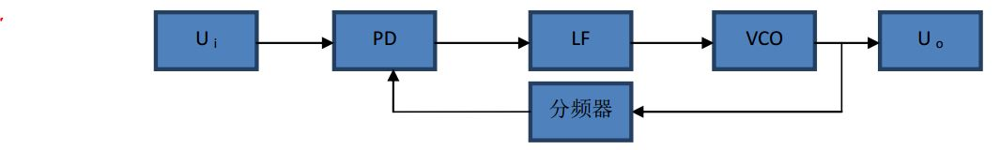
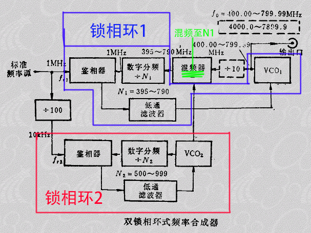
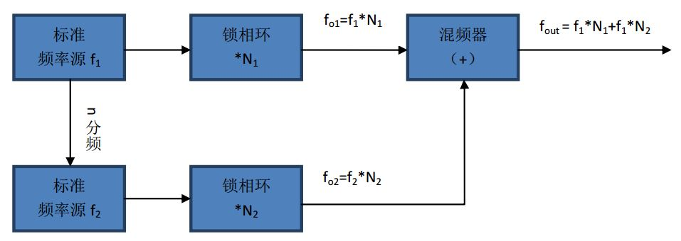

# 微波测量

1. 分频器
	分频器是数字电路中比较简单而且很容易实现的一个器件，我们仅仅使用一个计数器就能够实现分频，例如二进制的计数器就是二分频，十进制计数器就是十分频；但是我们无法使用计数器实现小数分频。
2. 锁相环
	锁相环是一个闭环的系统。能够**利用利用外部输入的参考信号控制环路内部振荡信号的频率和相位**锁相环是由三部分构成
	* PD（鉴相器）
	* LF（环路滤波-低通滤波器）
	* VCO（压控振荡器）
	
	组成。**锁相环能够实现输出信号频率对输入信号的频率的自动跟踪，所以锁相环通常用于闭环跟踪电路**。当输入信号和输出信号的频率相等，电压相位差恒定时输入电压即被输出电压锁定。

             

3. 锁相倍频器(锁相分频器)
	有了这些分频器和锁相环之后我们的倍频器就很容易实现了只要在锁相环回路中加入一个对输出信号n分频的分频器就可以实现最终fo/fi=n，这就实现了输入信号的倍频输出。这样就完成了输入信号的倍频输出。

|... &nbsp; &nbsp; &nbsp; &nbsp; &nbsp; &nbsp; &nbsp; &nbsp; &nbsp; &nbsp; &nbsp; &nbsp;&nbsp; &nbsp;&nbsp;&nbsp; &nbsp;&nbsp; &nbsp;&nbsp; |...|..&nbsp; &nbsp; &nbsp; &nbsp; &nbsp; &nbsp; &nbsp; &nbsp; &nbsp; &nbsp; &nbsp; &nbsp;&nbsp; &nbsp;&nbsp;&nbsp; &nbsp;&nbsp; &nbsp;&nbsp;|
| :-: | :-: |
|  |  ||

4. 双锁相环式频率合成器

|... &nbsp; &nbsp; &nbsp; &nbsp; &nbsp; &nbsp; &nbsp; &nbsp; &nbsp; &nbsp; &nbsp; &nbsp;&nbsp; &nbsp;&nbsp;&nbsp; &nbsp;&nbsp; &nbsp;&nbsp; |...|..&nbsp; &nbsp; &nbsp; &nbsp; &nbsp; &nbsp; &nbsp; &nbsp; &nbsp; &nbsp; &nbsp; &nbsp;&nbsp; &nbsp;&nbsp;&nbsp; &nbsp;&nbsp; &nbsp;&nbsp;|
| :-: | :-: |
|  |   ||

图中锁相环1也叫做主环所能提供的最小输出步级为1MHz。将1MHz的标准频率经100倍分频之后为锁相环2也叫做辅环提供标准频率为10KHz。而当辅助环的数字分频器N2在500~999之间跳变时，辅助环可以提供5.00~9.99MHz，每步为10KHz的小范围可变频率，作为混频信号f1送给主环的混频器，与取自VCO1的信号混频。在主环的作用下，当它的数字分频器的分频比N1在395~790之间取值时，于是VCO1产生的加到混频器的频率信号就是在400.00~799.99MHz之间，步级为10KHz。如果我们要求输出为4000.0~7999.9MHz的微波段，便要求在VCO1与混频器之间加一个10分频的分频器，同时最小步级也变成了100KHz。

|... &nbsp; &nbsp; &nbsp; &nbsp; &nbsp; &nbsp; &nbsp; &nbsp; &nbsp; &nbsp; &nbsp; &nbsp;&nbsp; &nbsp;&nbsp;&nbsp; &nbsp;&nbsp; &nbsp;&nbsp; |...|..&nbsp; &nbsp; &nbsp; &nbsp; &nbsp; &nbsp; &nbsp; &nbsp; &nbsp; &nbsp; &nbsp; &nbsp;&nbsp; &nbsp;&nbsp;&nbsp; &nbsp;&nbsp; &nbsp;&nbsp;|
| :-: | :-: |
|  |   ||


一个频率较高的基准频率源f1经过分频之后产生一个频率较低的频率源f2，高频的频率源f1经过锁相环1产生输出频率范围大但是步级也大的频率信号fo1，低频的频率源f2经过锁相环2产生步级小但是输出频率范围也小的频率信号fo2；
最终两个输出信号fo1和fo2经过混频器混频之后就可以产生输出频率范围大步级又小的频率信号fout，其中锁相环2产生的步级小的频率信号弥补了锁相环1产生的输出范围大但是步级也大的的缺点，从而用两个锁相环达到了实现输出频率范围大同时步级小的频率信号。

例如：
我们的一个标准频率源f1=1Mhz,n分频为100倍分频，所以得到的低频的标准频率元f2就是10Khz。假设锁相环1的倍频系数是395~790，那么得到的fo1=f1*N1=395Mhz~790Mhz，同时假设锁相环2的倍频系数是500~999，那么得到的fo2=f2*N2=5~9.99Mhz。所以我们从最终的输出端口得到的输出信号的
输出范围是：400Mhz~799.99Mhz
步级大小是：0.01Mhz(10Khz)
最终我们利用双锁相环解决了频率合成器提高输出频率范围和减小输出信号步级的矛盾。


```
破解markdown 到 pro
https://www.jianshu.com/p/8a1bd4892291

https://blog.csdn.net/qq_42379922/article/details/81063667
```