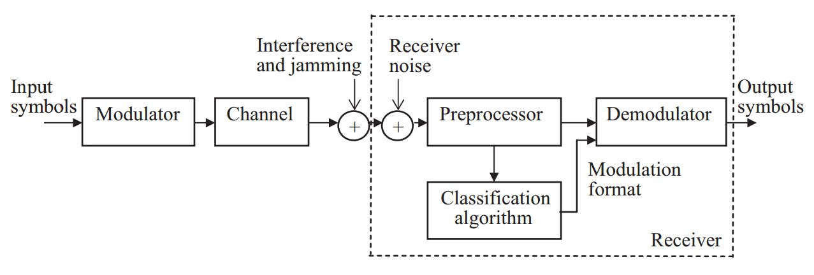

## 信号检测方法
由于老师要求读论文<Survey of automatic modulation classifion techniques:classical approaches and new trends>论文中有大量的公式不好读懂，中间还是记录的作为相关的素材。

1. Likelihood-based approach to AMC（基于可能性的自动调制分类方法）
	* ALRT-based algorithms
	* GLRT-and HLRT-based algorithms

2. Feature-based approach to AMC（基于特征的自动调制分类方法）
	* FB algorithms to distinguish between different classes
	* FB algorithms for linearly modulated signals
	* FB algorithms for FSK signals
	
## AMC(Automatic Modulation Classification)
**自动调制分类**是**信号检测和解调**之间的中间步骤

## AMC系统整体框架图

|英文|解释|
| :-: | :-: |
|modulator|调制器|
|interference and jamming|干扰|
|Receiver noise|接收器噪声|
|preprocessor|预处理器|
|modulation format|调制格式|
|demodulator|解调器|
|output symbols|输出符号|

## 调制分类器的设计步骤
基本上调制分类器的设计步骤分为两个部分
* 信号预处理
* 分类算法的选择
预处理任务一般包括但是不限于这些过程降噪、载波频率估计、符号周期、信号功率、均衡等。根据第二步中选择的分类算法需要进行不同精度水平的预处理任务。一些分类算法需要精确估计位置参数，而一些算法不需要。

##### OFDM
即：orthogonal frequency division multiplexing正交分频复用技术
http://www.360doc.com/content/16/1219/21/39227887_616103954.shtml

##### 迪利克雷函数

在科学和数学中，狄拉克δ函数或简称δ函数（译名德尔塔函数、得耳他函数）是在实数线上定义的一个广义函数或分布。它在除零以外的点上都等于零，且其在整个定义域上的积分等于1。[1][2][3]δ函数有时可看作是在原点处无限高、无限细，但是总面积为1的一个尖峰，在物理上代表了理想化的质点或点电荷的密度。[4]

从纯数学的观点来看，狄拉克δ函数并非严格意义上的函数，因为任何在扩展实数线上定义的函数，如果在一个点以外的地方都等于零，其总积分必须为零。[5][6]δ函数只有在出现在积分以内的时候才有实质的意义。根据这一点，δ函数一般可以当做普通函数一样使用。它形式上所遵守的规则属于运算微积分的一部分，是物理学和工程学的标准工具。包括δ函数在内的运算微积分方法，在20世纪初受到数学家的质疑，直到1950年代洛朗·施瓦茨才发展出一套令人满意的严谨理论。[3]严谨地来说，δ函数必须定义为一个分布，对应于支撑集为原点的概率测度。在许多应用中，均将δ视为由在原点处有尖峰的函数所组成的序列的极限（弱极限），而序列中的函数则可作为对δ函数的近似。

在信号处理上，δ函数常称为单位脉冲符号或单位脉冲函数。[7]克罗内克δ函数是对应于狄拉克δ函数的离散函数，其定义域为离散集，值域可以是0或者1。

>(全篇总结自论文)

## 最大似然估计

极大似然估计，只是一种概率论在统计学的应用，它是参数估计的方法之一。**说的是已知某个随机样本满足某种概率分布，但是其中具体的参数不清楚，参数估计就是通过若干次试验，观察其结果，利用结果推出参数的大概值**。最大似然估计是建立在这样的思想上：已知某个参数能使这个样本出现的概率最大，我们当然不会再去选择其他小概率的样本，所以干脆就把这个参数作为估计的真实值。

　　求最大似然函数估计值的一般步骤：

　　（1）写出似然函数；

　　（2）对似然函数取对数，并整理；

　　（3）求导数，令导数为0，得到似然方程；

　　（4）解似然方程，得到的参数即为所求；