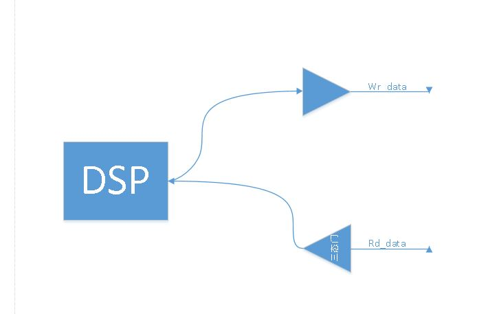
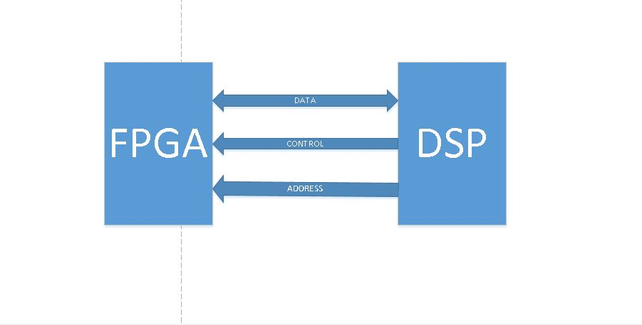

## DMA相关知识

内存<->CPU<->IO口<->各种外设

如何各种外设想要向内存中写入数据就要经过IO口和CPU这样CPU 就无法解放出来进行运算，但是DMA（直接内存读取）就能够通过占用总线接口直接完成外设数据写入到内存中。

## 三态门相关知识

三态们可以随时上锁从而控制数据的传输

## DSP和FPGA的配合使用

可以使用verilog来实现数据的FPAG和DSP数据间的双向传输

在硬件上想要完成双向传输可以使用三态门

## 放大器的虚短虚断的相关计算

1. 虚短：

	虚短是**从电压角度考虑**，是指两输入端的电压相同

2. 虚断：

	虚断是**从电流角度考虑**，是指两个输入端的输入电流为0

虚短的形成原因：
	由于运放电压放大倍数很大(一般开环电压放大倍数80dB以上，也就是两端的电压差只要达到mv级别，输出电压就能达到极限)
虚断的形成原因：
	运放的差模输入电阻很大（一般都是MΩ级别的，所以输入电流也就非常的小）

>https://blog.csdn.net/qq_29350001/article/details/52982870
	
