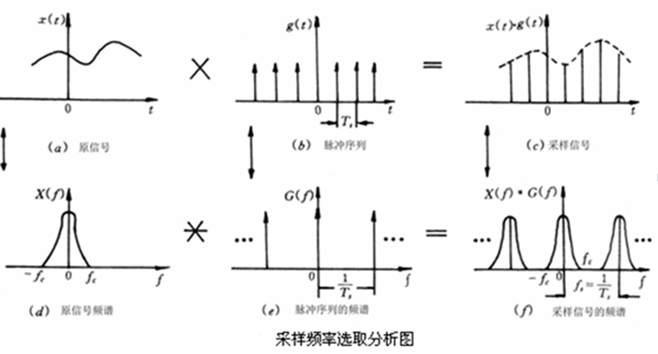
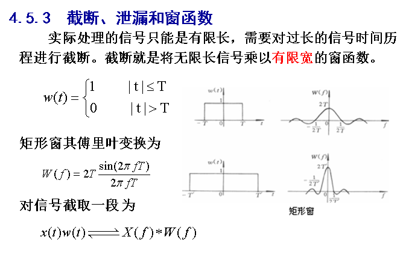
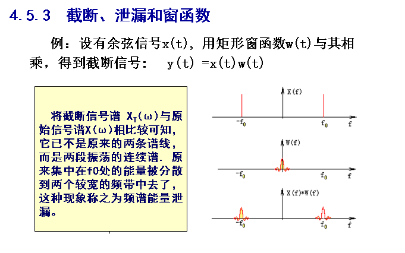
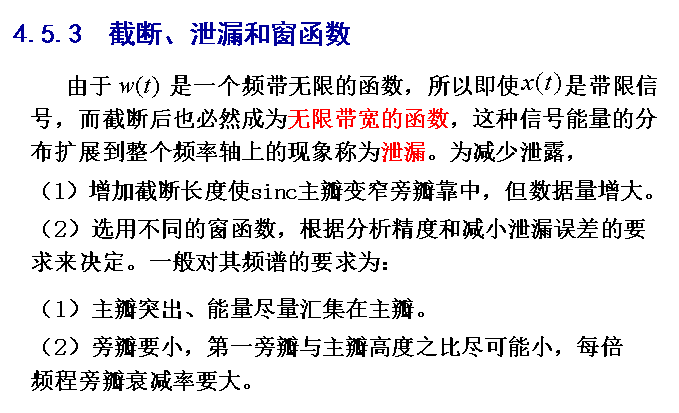
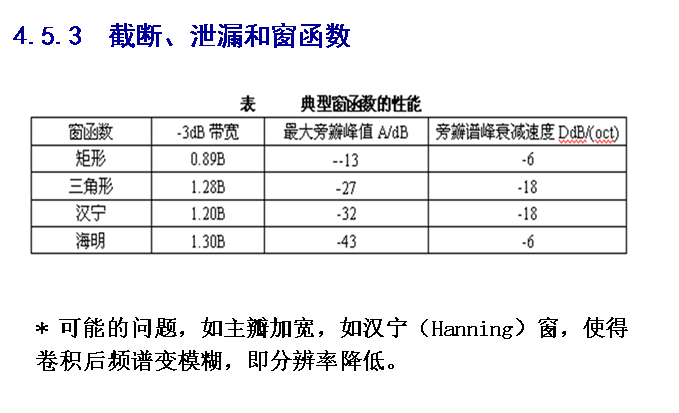
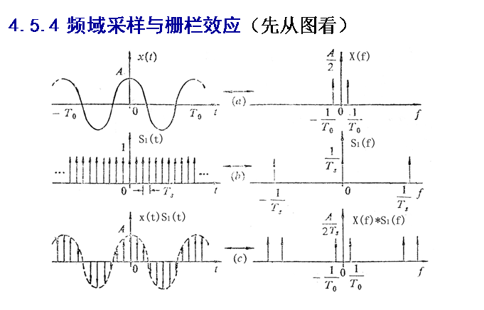
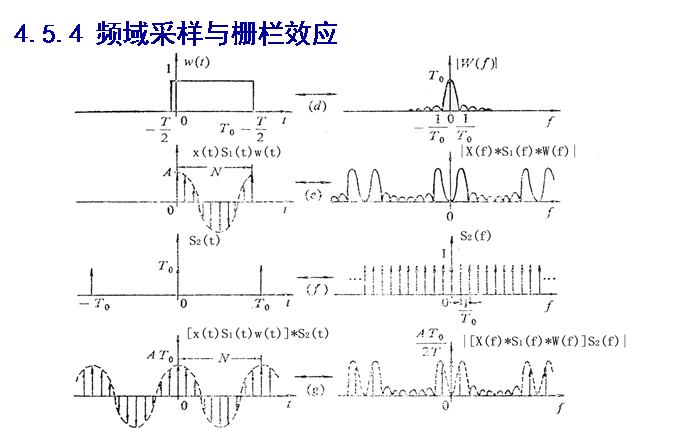

## 傅里叶变换

傅里叶变换中的相空间（频率空间）与实际图像空间并不是一一对应的，频率空间上的任何一点，哪怕只有一个点都与原来的整幅图像有关，高频信息缺失会使图像变得模糊。

频率空间中体现的是原图像的变化程度

傅里叶变换公式

* 连续傅里叶变换
	
* 离散傅里叶变换
	1. 离散傅里叶变换用于**数字信号采样**和处理中	
	* 定理1. 在时域以频率**f**采样，对应的频率域则以周期f将信号进行延拓

### 离散傅里叶变换运用到时域采样和采样定理中

$$x(t)g(t){\Longleftrightarrow}X(f)*G(f)$$

$$X(f)*G(f)=X(f)*\frac{1}{T}\sum_{\infty}^{n=-\infty}\delta(f-\frac{n}{T_{s}})=\frac{1}{T_{s}}\sum{\infty}{n=-\infty}X(f-\frac{n}{T_{s}})$$

* 采样定理
$$f_s=\frac{1}{T_{s}}>=2f_{c}$$

若被分析的信号中含有高频分量，则其频带为一个很宽的区域。**如果我们确知这个高频部分是由噪声干扰所致**，为了满足采样定理而又不致使处理数据过长，可以把信号线进行低通滤波处理。

>https://www.zhihu.com/question/52041057/answer/129004579

## 卷积

卷积公式
称$$(f*g)(n)$$为f,g的卷积

* 卷积公式的定义：
	1. 连续的定义为:$$(f*g)(n)=\int_{\infty}^{-\infty}f({\tau})g(n-{\tau}){d}{\tau}$$	
	2. 离散的定义为:$$(f*g)(n)=\sum_{\infty}^{-\infty}f({\tau})g(n-{\tau})$$
* 连续卷积公式的解释
	1. 通俗的解释：
		对于连续的卷积，如果想要通俗的理解的话，可以先不适用数学语言进行描述；**可以将函数g(x)看成一个随积分变量变化的的衰减因子；将函数f(x)看成一个不断产生新的作用的因子**接下来分析一下积分符号中的变量，为什么积分号中是$$g(n-{\tau})$$而$$f(n)$$,两个函数中的变量不同，我们可以理解为，最开始产生的作用将会一直衰减到卷积的终点，而最后产生的作用则在卷积的额终点才刚刚开始产生衰减。
	2. 通俗的解释的例子
		楼下早点铺子生意太好了，供不应求，就买了一台机器，不断的生产馒头。假设馒头的生产速度是f(t)，那么一天后生产出来的馒头总量为：
			
		$$\int_{0}^{24}f(t){d}t$$	
	
		馒头生产出来之后，就会慢慢腐败，假设腐败函数为g(t)，比如，10个馒头，24小时会腐败：

		$$10*g(t)$$

		想想就知道，第一个小时生产出来的馒头，一天后会经历24小时的腐败，第二个小时生产出来的馒头，一天后会经历23小时的腐败。如此，我们可以知道，一天后，馒头总共腐败了：

		$$\int_{0}^{24}f(t)g(24-t)$$
	
		这就是连续的卷积。

		转载自：https://www.zhihu.com/question/22298352/answer/228543288

## 虚数  

1. 首先虚数的正式提出
	1799年维塞尔正式把虚数当做二维数表示成a+bi的形式，并提出了重要的复平面概念和辐角的概念
2. 虚数在现实世界中的意义
	- 小数
		很早以前的欧洲人认为这个世界上只有正整数而没有小数
	- 负数
		之后人们又认为这个世界上存在负数是不可理解
	- 虚数
		...
	其实任何数字都是人类发明出来的描述世界的工具，不一定全部都是具有物理意义
	复数和普通的数字一样都是我们用来描述这个世界的工具，

实数是横轴，虚数是纵轴，但是这个世界并不是非实即虚。

## 共轭

## 三角函数的正交

- 定理：组成三角级数的函数系
	$$1,cosx,sinx,cos2x,sin2x,...,cosnx,sinnx,...$$在$[-\pi,\pi]$上正交，即其中任意两个不同的函数之积在$[-\pi,\pi]$上的积分等于0

	证明:

	$$\int_{-\pi}^{\pi}1*cosnx{d}x=\int_{-\pi}^{\pi}1*sinnx{d}x=0 (n=1,2,...)$$

	
	$$\int_{-\pi}^{\pi}coskx*cosnx{d}x=\frac{1}{2}\int_{-\pi}^{\pi}[cos(k+n)x+cos(k-n)x]{d}x=0 (k\not=1,2,3...)$$
	
	同理可证：

	$$\int_{-\pi}^{\pi}sinkx*sinnx{d}x=0    (k\not=n)$$

	$$\int_{-\pi}^{\pi}coskx*sinnx{d}x=0    (k\not=n)$$

	

	但是在三角函数系中两个相同的函数的乘积在$[-\pi,\pi]$上的积分不等于0而且有：

	$$\int_{-\pi}^{\pi}1*1{d}x=2\pi $$

	$$\int_{-\pi}^{\pi}cos^2nx{d}x=\pi$$

	$$\int_{-\pi}^{\pi}sin^2nx{d}x=\pi(n=1,2,...)$$

	$$\int_{-\pi}^{\pi}sinnxcosnx{d}x=0$$

	倍角公式：

	$$cos^2nx=\frac{1+cos2nx}{2},sin^2nx=\frac{1-cos2nx}{2}$$

## 开始开始第一次扯一下傅里叶变换（个人意见）

1. 首先观点：
	
	认为简单的傅里叶级数变换就是利用三角函数的正交性，将一个现实世界的信号（一般把一个信号看成一个跟随时间变化的信号幅度量A和时间t），从频率的角度对信号进行分类

	现实中

1. 历史由来

	傅里叶早在1807年就写成关于热传导的基本论文《热的传播》，向巴黎科学院呈交，但经拉格朗日、拉普拉斯和勒让德审阅后被科学院拒绝，1811年又提交了经修改的论文，该文获科学院大奖，却未正式发表。傅里叶在论文中推导出著名的热传导方程 ，并在求解该方程时发现解函数可以由三角函数构成的级数形式表示，从而提出任一函数都可以展成三角函数的无穷级数。傅里叶级数（即三角级数）、傅里叶分析等理论均由此创始。
2. 傅里叶级数的定义

	任何函数都可以由无限的三角函数进行逼近

	$$ f(x)=\frac{a_0}{2}+\sum_{\infty}^{n=1}(a_ncos(\frac{2{\pi}nx}{T}) + b_nsin(\frac{2{\pi}nx}{T}))$$

	其中上面表达式的系数$$a_n,b_n$$的求法是：

	$$ a_n=\frac{2}{T}\int_{x_0+T}^{x_0}f(x)*cos(\frac{2{\pi}nx}{T}){d}x,n{\in}{0}{\cup}N  $$

	$$b_n=\frac{2}{T}\int_{x_0+T}^{x_0}f(x)*sin(\frac{2{\pi}nx}{T}){d}x,n{\in}N   $$

	从[向量空间的角度解释](https://www.matongxue.com/madocs/712.html)原文作者解释道傅里叶级数是向量，在上式中把$$f(x)$$当作了如下基的向量

	\begin{Bmatrix}
	1,cos(\frac{2{\pi}n}{T}x),sin(\{2{\pi}n}{T}x)
	\end{Bmatrix}  （这里注意{}有特殊的表示方法）

	上面的式子可以化成：

	\begin{matrix} 
	\begin{split}
	5050 \\ 
	\overbrace{ 1+2+\cdots+100 }
	\end{split}
	\end{matrix}

	其实傅里叶级数中求系数的计算过程就是一个求坐标的过程（在一个有无穷个坐标的坐标系中进行求解）

**但是我们是不是可以从另一个角度来看**就是已经假定任何普通函数都是可以分解为三角函数构成，所以傅里叶函数相当于一个滤波器，将特定频率的波都筛选出来。
	

## 调幅波

* 假设一个调幅波是$$f(t)=2*sin(2*{\pi}*12*t)*10*sin({\pi}t)$$一个载波信号一个加载信号。而根据**积化和差公式**我们可以得到原$$f(t)=-10*[cos(13*{\pi}x)-cos(11*{\pi}x)]$$所以调幅波在频域内是有两条谱线的。对于已知的简单周期信号我们能够使用公式进行解决，但是与三角函数无关的周期信号我们能利用傅里叶变换对原信号进行变换从而得到相应的频域的表示。

	

## 积化和差公式
	
$$\alpha  \beta$$

$$ sin{\alpha}cos{\beta}=\frac{1}{2}[sin({\alpha}+{\beta})+sin({\alpha}-{\beta})]$$

$$ cos{\alpha}sin{\beta}=\frac{1}{2}[sin({\alpha}+{\beta})-sin({\alpha}-{\beta})]$$

$$ cos{\alpha}cos{\beta}=\frac{1}{2}[cos({\alpha}+{\beta})+cos({\alpha}-{\beta})]$$

$$ sin{\alpha}sin{\beta}=\frac{1}{2}[cos({\alpha}+{\beta})-cos({\alpha}-{\beta})]$$

## 和差化积

$$ sin({\alpha}+{\beta})=sin({\alpha})cos({\beta})+cos({\alpha})sin({\beta})$$

$$ sin({\alpha}-{\beta})=sin({\alpha})cos({\beta})-cos({\alpha})sin({\beta})$$

$$ cos({\alpha}+{\beta})=cos({\alpha})cos({\beta})-sin({\alpha})sin({\beta})$$

$$ cos({\alpha}-{\beta})=cos({\alpha})cos({\beta})+sin({\alpha})sin({\beta})$$

[latex常用的公式和符号](https://blog.csdn.net/garfielder007/article/details/51646604)

$$ \overset{\infty}{V}  \in \notin$$

## 卡方分布、t分布

* 卡方分布是**一些服从正态分布的数的平方和**，有几个数就是服从自由度为几的卡方分布
* t分布是由一个服从**正态分布**的随机变量除以一个服从**卡方分布**的变量组成的。
* F分布是由两个服从卡方分布的随机变量构成的，t分布的平方就是自由度为1的F分布。
