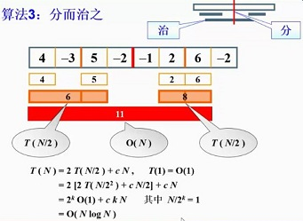

## 题目描述

寻找一个数列中的最大子列和例如一个数列：

10

-10 1 2 3 4 -5 -23 3 7 -21

最终的输出结果：


10 1 4（最大子列和  ，子列的第一个值，子列的最后一个值）


### 第一种算法  复杂度 $O(N^3)$

```
int max = 0;
	int temp_max = 0;
	for (int i = 0; i < container.size();i++){
		for (int j = i; j < container.size();j++){
			for (int k = i; k <= j;k++){
				temp_max += container[k];
			}
			
			if (temp_max>=max){
				max = temp_max;
			}
			temp_max = 0;
		}
	}
```

### 第二种算法   复杂度 $O(N^3)$

```
	int max = 0;
	int temp_max = 0;
	for (int i = 0; i < container.size(); i++){
		for (int j = i; j < container.size(); j++){
				
			temp_max += container[j];

			if (temp_max >= max){
				max = temp_max;
			}
		}
		temp_max = 0;
	}
```

### 第三种算法   复杂度 $O(NlogN)$

| 图（来自中国大学mooc） | 
| :-: |
||

```
struct Return_value{
	int left;
	int right;
	int sum;
};
//Return_value return_value;
Return_value return_max_sum_sequence(vector<int>&input_container,int start,int end){
	Return_value return_value;
	Return_value return_value_left;
	Return_value return_value_right;
	if(end-start>=1){
		return_value_left = return_max_sum_sequence(input_container,start,start+(end-start)/2);
		return_value_right = return_max_sum_sequence(input_container,start+(end-start)/2+1,end);
		
		if (return_value_left.left == -1){
			if (return_value_right.left == -1){
				//-1 -1
				return_value.left = return_value.right = -1;
				return_value.sum = 0;
				return return_value;
			}
			else{
				//-1 9 || -1 9 0 8
				return return_value_right;
			}
		}
		else{
			if (return_value_right.left == -1){
				//9 -1 ||9 8 ... -2
				return return_value_left;
			}
			else{
				//最常见的类型
				int temp_left = input_container[return_value_left.right];
				int temp_right = input_container[return_value_right.left];

				input_container[return_value_left.right] = return_value_left.sum;
				input_container[return_value_right.left] = return_value_right.sum;

				int cross_middle_left_max = 0;
				int temp_left_max = 0;
				int temp_left_max_position = -1;
				for (int i = start + (end - start) / 2; i >= return_value_left.right;i--){
					cross_middle_left_max += input_container[i];
					if (temp_left_max < cross_middle_left_max){//加不加等号
						if (i == return_value_left.right){
							temp_left_max_position = return_value_left.left;
						}
						else{
							temp_left_max_position = i;
						}
						temp_left_max = cross_middle_left_max;
					}
				}
				int cross_middle_right_max = 0;
				int temp_right_max = 0;
				int temp_right_max_position = -1;
				//自己忽视了后来又加上了如果右边的连续的最大值就是0呢，解决这个问题
				for (int i = start + (end - start) / 2+1; i <= return_value_right.left; i++){
					cross_middle_right_max += input_container[i];
					if (temp_right_max < cross_middle_right_max){//加不加等号
						if (i == return_value_right.left){
							temp_right_max_position = return_value_right.right;
						}
						else{
							temp_right_max_position = i;
						}
						temp_right_max = cross_middle_right_max;
					}
				}
				input_container[return_value_left.right] = temp_left;
				input_container[return_value_right.left] = temp_right;
				//进行比较
				if (temp_left_max_position == -1||temp_right_max_position == -1){
					
						//最大序列存在左右两边不会跨国中线
						if (return_value_left.sum >= return_value_right.sum){
							return return_value_left;
						}
						else{
							return return_value_right;
						}
				}
				else{
					if (temp_right_max + temp_left_max > return_value_left.sum 
						&& temp_right_max + temp_left_max >= return_value_right.sum){

						return_value.left = temp_left_max_position;
						return_value.right = temp_right_max_position;
						return_value.sum = temp_right_max + temp_left_max;
						return return_value;

					}
					else{
						if (return_value_left.sum >= return_value_right.sum){
							return return_value_left;
						}
						else{
							return return_value_right;
						}
					}
				}
			}
		}
	}
	else{
		if (input_container[start] < 0){
			return_value.left = return_value.right = -1;
			return_value.sum = 0;
		}
		else{
			return_value.left = return_value.right = start;
			return_value.sum = input_container[start];
		}
		return return_value;
	}

}
```
### 第四种算法在线处理算法   算法复杂度（O(N)）

```
int temp_max = 0;
	int max = 0;

	int temp_position1 = -1;
	int temp_position2 = -1;

	int real_position1 = -1;
	int real_position2 = -1;

	for (int i = 0; i < container.size();i++){
		temp_max += container[i];
		if (temp_position1 == -1){
			temp_position1 = i;
			temp_position2 = i;
		}
		else{
			temp_position2 = i;
		}

		if (temp_max<0){
			temp_max = 0;
			temp_position1 = -1;
			temp_position2 = -1;
		}
		else if (temp_max>max){
			max = temp_max;
			real_position1 = temp_position1;
			real_position2 = temp_position2;
		}
	}
```

