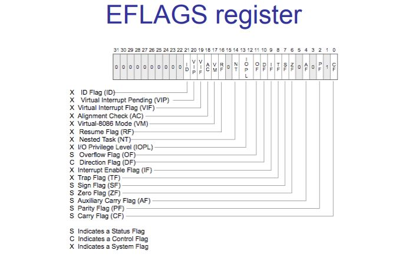

计算机中的寄存器手心intel芯片的寄存器

80386型芯片的内部寄存器

通用性寄存器:
eax
ebx
ecx
edx

段寄存器
cs  代码段寄存器
ds	数据段寄存器
es	辅助段段寄存器
ss	栈段寄存器

fs	辅助段段寄存器
gs	辅助段寄存器（以上两个寄存器是i386新加入的用于用于减轻es的负担）

指针寄存器
sp	段指针寄存器
bp	基数指针寄存器（配合sp进行使用）
ip 	指令指针

变址寄存器（SI,DI）
SI  源变址寄存器
DI	目的变址寄存器

标志寄存器
eflag
