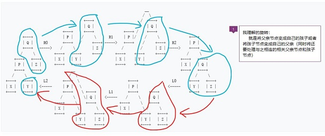

## 题目描述

><a href="https://pintia.cn/problem-sets/16/problems/667">PAT中的AVL树题型</a>   


### 树的旋转操作

><a href="https://zh.wikipedia.org/wiki/%E6%A0%91%E6%97%8B%E8%BD%AC">树的旋转维基百科</a>

1. 树的旋转的解释

   树旋转是在二叉树中的一种子树调整操作，每一次旋转并**不影响对该二叉树进行中序遍历的结果**。树旋转通常应用于需要调整树的局部平衡性的场合。


```

        +---+                          +---+
        | Q |                          | P |
        +---+                          +---+
       /     \     right rotation     /     \
    +---+   +---+  ------------->  +---+   +---+
    | P |   | Z |                  | X |   | Q |
    +---+   +---+  <-------------  +---+   +---+
   /     \          left rotation         /     \
+---+   +---+                          +---+   +---+
| X |   | Y |                          | Y |   | Z |
+---+   +---+                          +---+   +---+

其中, 右旋转详细步骤如下图 R0, R1, R2 三个步骤所示, 左旋转则如 L0, L1, L2 三个步骤所示.

                                                                  __
                                                                 /  \
                                     +---+                      /  +---+
                                     | Q |                     /   | Q |
                           +---+     +---+              +---+ /    +---+
        +---+              | P |    /     \      R1     | P |/    /     \              +---+
        | Q |     R0       +---+   /     +---+ ----->   +---+    /     +---+   R2      | P |
        +---+   ----->    /     \ /      | Z |         /        /      | Z | ----->    +---+
       /     \         +---+   +---+     +---+      +---+    +---+     +---+          /     \
    +---+   +---+      | X |   | Y |                | X |    | Y |                 +---+   +---+
    | P |   | Z |      +---+   +---+                +---+    +---+                 | X |   | Q |
    +---+   +---+              __                                                  +---+   +---+
   /     \                    /  \                                                        /     \
+---+   +---+     L2       +---+  \                       +---+                L0      +---+   +---+
| X |   | Y |   <-----     | P |   \                      | P |              <-----    | Y |   | Z |
+---+   +---+              +---+    \ +---+      L1       +---+     +---+              +---+   +---+
                          /     \    \| Q |    <-----    /     \    | Q |
                       +---+     \    +---+           +---+     \   +---+
                       | X |      \        \          | X |      \ /     \
                       +---+     +---+    +---+       +---+     +---+   +---+
                                 | Y |    | Z |                 | Y |   | Z |
                                 +---+    +---+                 +---+   +---+
```




AVL树的插入

1. AVL树也是二叉搜索树，插入与二叉搜索树操作类似。不过要加上**调整树高的操作**那就要要在树的每一个节点上增加一个平衡因子
平衡因子的取值为：0 1 -1 2 -2

	* 0代表左右子树等高
	* 1代表右孩子高度比左孩子高1
	* -1代表右孩子高度比左孩子低1 
	* 2代表右孩子高度比左孩子高2     ->需要就行高度调整
	* -2代表右孩子高度比左孩子低2    ->需要就行高度调整

2. 高度调整操作共四种

	* 左单旋
	* 右单旋
	* 先左旋后右旋
	* 先右旋后左旋


	