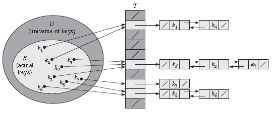

#hashtable
hashtable也叫做散列表
是一种输入与容器位置的一种映射关系
由于容器的大小受限所以最终的我们在进行散列映射的时候可能会出现冲突的情况

- hashtable解决冲突的方法

	1. 开放寻址法
		- 线性探测法
		- 平方探测法
		- 二度哈希
		- 双散列函数探查法
	2. 拉链法（哈希桶）
	3. 建立公共溢出区
		将哈希表分为公共表和溢出表，当溢出发生时，将所有溢出数据统一放到溢出区。
- hashfunction
	1. 取余哈希（最常见，最简单）
	
		hash(key) = key mod m
		m一般取合适的质数
	2. 乘法哈希

		hash(key) = floor( m * ( A * key mod 1) )

	3. 全域哈希
	
		hasha,b(key) = ((a*key + b) mod p) mod m
		
		其中，p 为一个足够大的质数，使得每一个可能的关键字 key 都落在 0 到 p - 1 的范围内。m 为哈希表中槽位数。任意 a∈{1,2,3,…,p-1}，b∈{0,1,2,…,p-1}。
- perfect hash function
	见以下细节
- string hash
	https://www.cnblogs.com/wenqiang/p/6762071.html
	http://www.partow.net/programming/hashfunctions/#
	这个link中内容较多包括渲染引擎等
	

##细节

1. 线性探测发
	通过散列函数hash(key)，找到关键字key在线性序列中的位置，如果当前位置已经有了一个关键字，就产生了哈希冲突，就往后探测hash(key+i)<==><(key+i)%N>个位置（i小于线性序列的大小），直到当前位置没有关键字存在。（\#自己的：增量可以是正可以是负）
2. 平方探测法
	与上的原理相同，只不过探测的时候采用的增量是一个数的平方，同样增量也是可正可负
3. 二度哈希（Rehashing）（或称为双重哈希（Double Hashing））<改进的方法>
	有一个包含一组哈希函数 H1...Hn 的集合。当需要从哈希表中添加或获取元素时，首	先使用哈希函数 H1。如果导致冲突，则尝试使用 H2，以此类推，直到 Hn。所有的哈希	函数都与 H1 十分相似，不同的是它们选用的乘法因子（multiplicative 	factor）。

	在 .NET 中 Hashtable 类的哈希函数 Hk 的定义如下：
	
	Hk(key) = [GetHash(key) + k * (1 + (((GetHash(key) >> 5) + 1) % (hashsize – 1)))] % hashsize
	
	当使用二度哈希时，重要的是在执行了 hashsize 次探查后，哈希表中的每一个位置都有且只有一次被访问到。也就是说，对于给定的 key，对哈希表中的同一位置不会同时使用 Hi 和 Hj。在 Hashtable 类中使用二度哈希公式，其始终保持 (1 + (((GetHash(key) >> 5) + 1) % (hashsize – 1)) 与 hashsize 互为素数（两数互为素数表示两者没有共同的质因子）。

	二度哈希使用了 Θ(m2) 种探查序列，而线性探查（Linear Probing）和二次探查（Quadratic Probing）使用了Θ(m) 种探查序列，故二度哈希提供了更好的避免冲突的策略。

NOTE：同时我们需要注意我们应该预先估计哈希表中最有可能容纳的元素数量，在初始化哈希表时给予合适的值进行构造，以避免不必要的扩充。因为在进行扩充的时候哈希表的时候，位置空间值从当前的素数值增加到下一个合适的素数值，而在这之后一般都要进行一次rehash确定不同元素在新的申请的空间的位置

4. 链接技术（chaining）是一种冲突解决策略（Collision Resolution Strategy）。
	在链接法中，把哈希到同一个槽中的所有元素都放到一个链表中。如果	一个新的元素要被添加至哈希表中，将会被添加至其 Key 的哈希所对应的桶中。如	果在相同位置已经有一个元素存在了，则将会将新元素添加到列表的**前面**。使用	链接技术添加元素的操作涉及到哈希计算和链表操作，但其仍为常量，渐进时间为 O(1)。

	而进行查询和删除操作时，其平均时间取决于元素的数量和桶（bucket）的数量。具体的说就是运行时间为 O(n/m)，这里 n 为元素的总数量，m 是桶的数量。但通常对哈希表的实现几乎总是使 n = O(m)，也就是说，元素的总数绝不会超过桶的总数，所以 O(n/m) 也变成了常量 O(1)。  

	但是这个处理方法也并非一个完美的方法，这是因为如果hash函数选择不当的时候可能将所有的元素都映射到一个位置从而造成，在我们查找的时候这个哈希表的表现就像一个普通的链表一样。

5. 全域哈希法（Universal Hashing）

	在向哈希表中插入元素时，如果所有的元素全部被哈希到同一个桶中，此时数据的存储实际上就是一个链表，那么平均的查找时间为 Θ(n) 。而实际上，任何一个特定的哈希函数都有可能出现这种最坏情况，唯一有效的改进方法就是随机地选择哈希函数，使之独立于要存储的元素。这种方法称作全域哈希（Universal Hashing）。

	全域哈希的基本思想是在执行开始时，从一组哈希函数中，随机地抽取一个作为要使用的哈希函数。就像在快速排序中一样，随机化保证了没有哪一种输入会始终导致最坏情况的发生。同时，随机化也使得即使是对同一个输入，算法在每一次执行时的情况也都不一样。这样就确保了对于任何输入，算法都具有较好的平均运行情况。

	hasha,b(key) = ((a*key + b) mod p) mod m
	其中，p 为一个足够大的质数，使得每一个可能的关键字 key 都落在 0 到 p - 1 的范围内。m 为哈希表中槽位数。任意 a∈{1,2,3,…,p-1}，b∈{0,1,2,…,p-1}。
6. 完美哈希（Perfect Hashing）
	https://www.cnblogs.com/soyscut/p/3396216.html

	当关键字的集合是一个不变的静态集合（Static）时，哈希技术还可以用来获取出色的最坏情况性能。如果某一种哈希技术在进行查找时，其最坏情况的内存访问次数为 O(1) 时，则称其为完美哈希（Perfect Hashing）。

	设计完美哈希的基本思想是利用两级的哈希策略，而每一级上都使用全域哈希（Univeral Hashing）。
	

	第一级与使用链接技术（chaining）的哈希表基本上是一样的，利用从某一全域哈希函数族中随机选择的一个函数 h ，将 n 个关键字哈希到 m 个槽中。

	而此时，不像链接技术中对槽使用链表结构，而是采用一个较小的二次哈希表 Sj ，与其相关的哈希函数为 hj 。通过随机的选取哈希函数 hj ，可以确保在第二级上不出现哈希冲突。

	如果利用从一个全域哈希函数族中随机选择的哈希函数 h，将 n 个关键字存储在一个大小为 m = n2 的哈希表中，那么出现碰撞的概率小于 1/2 。

	为了确保第二级上不出现哈希冲突，需要让哈希表 Sj 的大小 mj 为哈希到槽 j 中的关键字数 nj 的平方。mj 对 nj 的这种二次依赖关系看上去可能使得总体存储需求很大，但通过适当地选择第一次哈希函数，预期使用的的总存储空间仍为 O(n)。

	如果关键字的数量 n 等于槽的数量 m ，则该哈希函数称为最小完美哈希函数（Minimal Perfect Hash Function）。

7. 载荷因子
	当载荷因子超过0.8时就得增容，载荷因子越高哈希冲突越多，不命中率越高。CPU缓存会大大升高。载荷因子a=填入表中元素的个数/散列表长度。
8. 双重散列函数探测法
	该方法是开放地址法中最好的方法之一，它的探查序列是：
	hi=(h(key)+i*h1(key))%m 0≤i≤m-1 //即di=i*h1(key)
	即探查序列为：
	d=h(key)，(d+h1(key))%m，(d+2h1(key))%m，…，等。
	该方法使用了两个散列函数h(key)和h1(key)，故也称为双散列函数探查法


def show
  @widget = Widget(params[:id])
  respond_to do |format|
    format.html # show.html.erb
    format.json { render json: @widget }
  end
end


