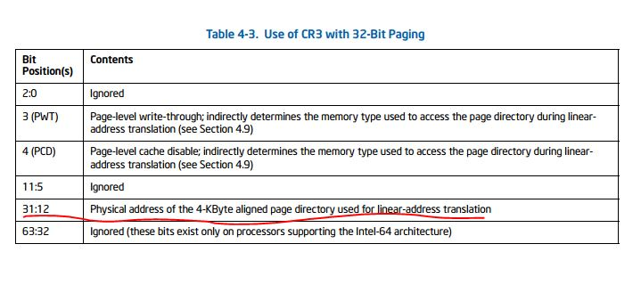

# jos使用的是32-Bits Paging

A logical processor uses 32-bit paging if CR0.PG = 1 and CR4.PAE = 0. 32-bit paging translates 32-bit linear
addresses to 40-bit physical addresses（if  support the PSE-36 mechanism,）.1 Although 40 bits corresponds to 1 TByte, linear addresses are limited to
32 bits; at most 4 GBytes of linear-address space may be accessed at any given time.

32-bit paging uses a hierarchy of paging structures to produce a translation for a linear address. CR3 is used to
locate the first paging-structure, the page directory. Table 4-3 illustrates how CR3 is used with 32-bit paging.

 

The following
items describe the 32-bit paging process in more detail as well has how the page size is determined:

* A 4-KByte naturally aligned page directory is located at the physical address specified in bits 31:12 of CR3 (see
Table 4-3). A page directory comprises 1024 32-bit entries (PDEs). **A PDE is selected using the physical address**
defined as follows:
	- Bits 39:32 are all 0.
	- Bits 31:12 are from CR3.
	- **Bits 11:2 are bits 31:22 of the linear address.**
	- Bits 1:0 are 0.

Because a PDE is identified using bits 31:22 of the linear address, it controls access to a 4-Mbyte region of thelinear-address space. Use of the PDE depends on CR4.PSE and the PDE’s PS flag (bit 7):

* If CR4.PSE = 1 and the PDE’s PS flag is 1, the PDE maps a 4-MByte page (see Table 4-4). The final physical
address is computed as follows:
	- Bits 39:32 are bits 20:13 of the PDE.
	- Bits 31:22 are bits 31:22 of the PDE.1
	- Bits 21:0 are from the original linear address.
* If CR4.PSE = 0 or the PDE’s PS flag is 0, a 4-KByte naturally aligned page table is located at the physicaladdress specified in bits 31:12 of the PDE (see Table 4-5). A page table comprises 1024 32-bit entries (PTEs).
**A PTE is selected using the physical address defined as follows:**
	- Bits 39:32 are all 0.
	- Bits 31:12 are from the PDE.
	- Bits 11:2 are bits 21:12 of the linear address.
	- Bits 1:0 are 0.
* Because a PTE is identified using bits 31:12 of the linear address, every PTE maps a 4-KByte page (see Table 4-6). **The final physical address is computed as follows:**
	- Bits 39:32 are all 0.
	- Bits 31:12 are from the PTE.
	- Bits 11:0 are from the original linear address.
	
If a paging-structure entry’s P flag (bit 0) is 0 or if the entry sets any reserved bit, the entry is used neither to reference another paging-structure entry nor to map a page. There is no translation for a linear address whose translation would use such a paging-structure entry; a reference to such a linear address causes a page-fault exception(see Section 4.7).
With 32-bit paging, there are reserved bits only if CR4.PSE = 1:

* If the P flag and the PS flag (bit 7) of a PDE are both 1, the bits reserved depend on MAXPHYADDR, and whether
the PSE-36 mechanism is supported:2
	- If the PSE-36 mechanism is not supported, bits 21:13 are reserved.
	- If the PSE-36 mechanism is supported, bits 21:(M–19) are reserved, where M is the minimum of 40 andMAXPHYADDR.
* If the PAT is not supported:3
	- If the P flag of a PTE is 1, bit 7 is reserved.
	- If the P flag and the PS flag of a PDE are both 1, bit 12 is reserved.
(If CR4.PSE = 0, no bits are reserved with 32-bit paging.)
A reference using a linear address that is successfully translated to a physical address is performed only if allowed by the access rights of the translation; see Section 4.6.

Table 4-3. Use of CR3 with 32-Bit Paging

| Bit Position(s) | Contents |
	| :-: | :-: |
|2:0| Ignored|
|3 (PWT)| Page-level write-through; indirectly determines the memory type used to access the page directory during linearaddress translation (see Section 4.9)|
|4 (PCD)| Page-level cache disable; indirectly determines the memory type used to access the page directory during linearaddress translation (see Section 4.9)|
|11:5| Ignored|
|31:12| Physical address of the 4-KByte aligned page directory used for linear-address translation|
|63:32| Ignored (these bits exist only on processors supporting the Intel-64 architecture)|

Table 4-5. Format of a 32-Bit **Page-Directory Entry** that References a Page Table

| Bit Position(s) | Contents |
|:-:|:-:|
|0 (P)| Present; must be 1 to reference a page table|
|1 (R/W)| Read/write; if 0, writes may not be allowed to the 4-MByte region controlled by this entry (see Section 4.6)|
|2 (U/S)| User/supervisor; if 0, user-mode accesses are not allowed to the 4-MByte region controlled by this entry (see Section4.6)|
|3 (PWT)| Page-level write-through; indirectly determines the memory type used to access the page table referenced by thisentry (see Section 4.9)|
|4 (PCD)| Page-level cache disable; indirectly determines the memory type used to access the page table referenced by this entry (see Section 4.9)|
|5 (A)| Accessed; indicates whether this entry has been used for linear-address translation (see Section 4.8)|
|6| Ignored|
|7 (PS)| If CR4.PSE = 1, must be 0 (otherwise, this entry maps a 4-MByte page; see Table 4-4); otherwise, ignored|
|11:8| Ignored|
|31:12| Physical address of 4-KByte aligned page table referenced by this entry|

Table 4-6. Format of a 32-Bit **Page-Table Entry** that Maps a 4-KByte Page

| Bit Position(s) | Contents |
|:-:|:-:|
|0 (P)| Present; must be 1 to map a 4-KByte page|
|1 (R/W)| Read/write; if 0, writes may not be allowed to the 4-KByte page referenced by this entry (see Section 4.6)|
|2 (U/S)| User/supervisor; if 0, user-mode accesses are not allowed to the 4-KByte page referenced by this entry (see Section4.6)|
|3 (PWT)| Page-level write-through; indirectly determines the memory type used to access the 4-KByte page referenced by this entry (see Section 4.9)|
|4 (PCD)| Page-level cache disable; indirectly determines the memory type used to access the 4-KByte page referenced by this entry (see Section 4.9)|
|5 (A)| Accessed; indicates whether software has accessed the 4-KByte page referenced by this entry (see Section 4.8)|
|6 (D)| Dirty; indicates whether software has written to the 4-KByte page referenced by this entry (see Section 4.8)|
|7 (PAT)| If the PAT is supported, indirectly determines the memory type used to access the 4-KByte page referenced by this entry (see Section 4.9.2); otherwise, reserved (must be 0)1|

